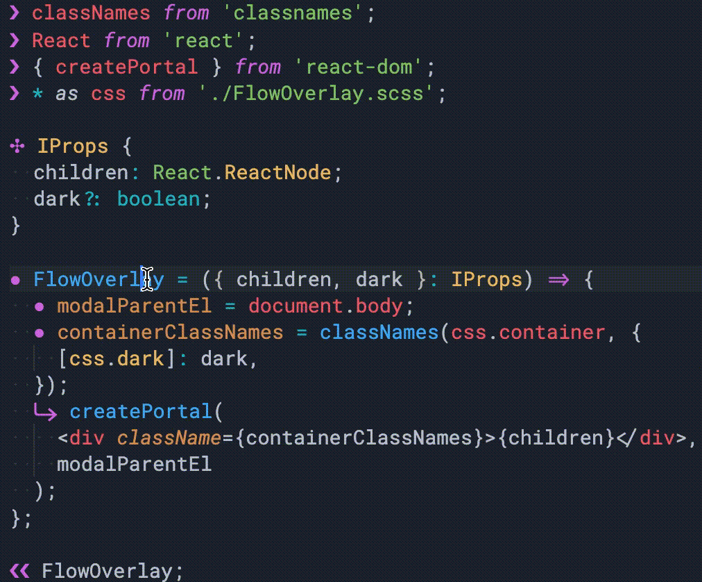
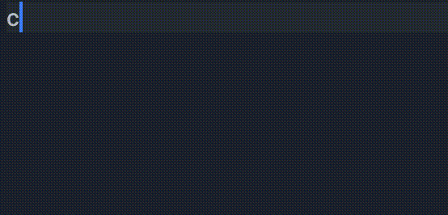

# Decorations for JS / TS

This is a plugin to cognitively enhance JavaScript and TypeScript developing experience. 
It hides some keywords that are oftenly used, such as `const` and `return`. Instead, it displays single character decorations for them.

It doesn't replace the text. It relies on decorations feature of VSCode. To toggle it, use <kbd>Cmd+K D</kbd>, or "Decorations for JS / TS: Toggle" in command palette.

## Motivation

This plugin exists because of a frustration that there are too many `const`s everywhere. `const` is a pretty long name for a keyword that's used that often. 

It used to be fine when there was only `var` as the variable declarator. 
Even at those times, tools like CoffeeScript was being prefered to address some language discomforts. Next to addressing the unnecessity of `var`, CoffeScript also tried to solve other problems like unnecessity of curly braces, and used indentation instead. (Not something this extension does)

Nowadays, many things in frontend development is shaped and centered around TypeScript, so it's very difficult to get rid of it and start using other transpilers/languages. So I thought I could achieve the DX upgrade I wanted via an editor extension.

## Mapping

| Keyword | Symbol | Keyword | Symbol |
|-----|------|-----|------|
|`var` | `∅` |`type` and `interface` | `✣` |
|`let` | `○` |`import` | `❯` |
|`const` | `●` |`export` | `❮` |
|`return` | `⮑` |`export default` | `❮❮` |

> Since `var`, `let`, and `const` are similar, they're all circles. `type` is like a fancy cousin of them. There's literally a "return" symbol for `return`, and lastly there are module related ones. I decided not to do anything for the rest of the keywords. 

## Examples

### While coding

> 

| Before | After |
|---|---|
|  |  |